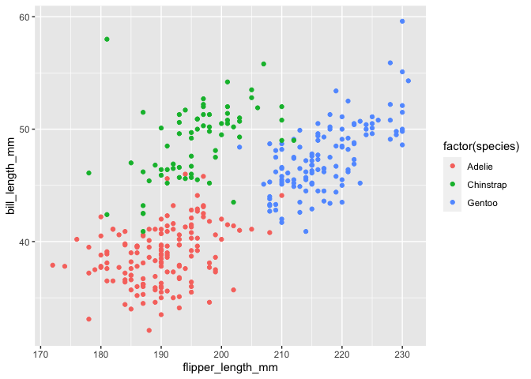

p8105_hw1_yh3554
================

``` r
library(tidyverse)
```

This is my first data science HW.

\#Problem 1

Load the dataset.

``` r
data("penguins", package = "palmerpenguins")
```

#### Description

The dataset includes the measurement of penguin species that collect
from islands of Plamer Archipelago of Antarctica. The variables are
species, island, body measurement (bill length in in millimeters , bill
depth in millimeters, flipper length in millimeters, body mass in gram),
sex, and year. The data has 344 rows and 8 variables. The mean of
flipper length is
`rround(mean(penguins$flipper_length_mm,na.rm=TRUE), 2)` millimeters.

#### Scatterplot

This is scatterplot of flipper length vs bill length.

``` r
ggplot(penguins, 
       aes(x = flipper_length_mm, y = bill_length_mm, 
           colour = factor(species))) + geom_point()
```

    ## Warning: Removed 2 rows containing missing values (geom_point).

<!-- -->

``` r
ggsave("scatterplot of hw1.pdf", height = 4, width = 6)
```

    ## Warning: Removed 2 rows containing missing values (geom_point).

# Problem 2

First I will create a dataframe.

``` r
set.seed(1)
p2_df <- tibble(
  norm_sample = rnorm(10),
  norm_logical = norm_sample > 0,
  vec_char = c("a", "b", "c", "d", "e", "f", "g", "h", "i", "j"),
  vec_factor = factor(c("group 1", "group 2", "group 3", "group 3", "group 3", "group 2", "group 1", "group 1", "group 3", "group 1"))
)
```

#### Mean of each variable.

``` r
mean_sample = mean(pull(p2_df, norm_sample))
mean_logical = mean(pull(p2_df, norm_logical))
mean_char = mean(pull(p2_df, vec_char))
```

    ## Warning in mean.default(pull(p2_df, vec_char)): argument is not numeric or
    ## logical: returning NA

``` r
mean_factor = mean(pull(p2_df, vec_factor))
```

    ## Warning in mean.default(pull(p2_df, vec_factor)): argument is not numeric or
    ## logical: returning NA

Only numeric variable and logical variable works. There were two warning
message when I take the mean of character variable and factor variable.
R returns NA since these two variable are not numeric or logical.

#### Convert variables to numeric variable

``` r
transform(p2_df, norm_logical = as.numeric(norm_logical))
transform(p2_df, vec_char = as.numeric(vec_char))
transform(p2_df, vec_factor = as.numeric(vec_factor))
```

The function `as.numeric` convert logical variable to 1 or 0, and
convert factor variable to 1, 2, or 3. While taking mean of these
variables, R automatically turn logical variable to 1 or 0. I can
coerces factor variable to 1, 2, or 3 because it has 3 levels. However,
it turns to NA when I apply the function to character variable. Since
character variable can be anything, it cannot being interpretable as
numbers. Thus we cannot coerces this variable to numeric. This explains
why there was warning message.
